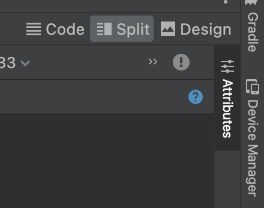
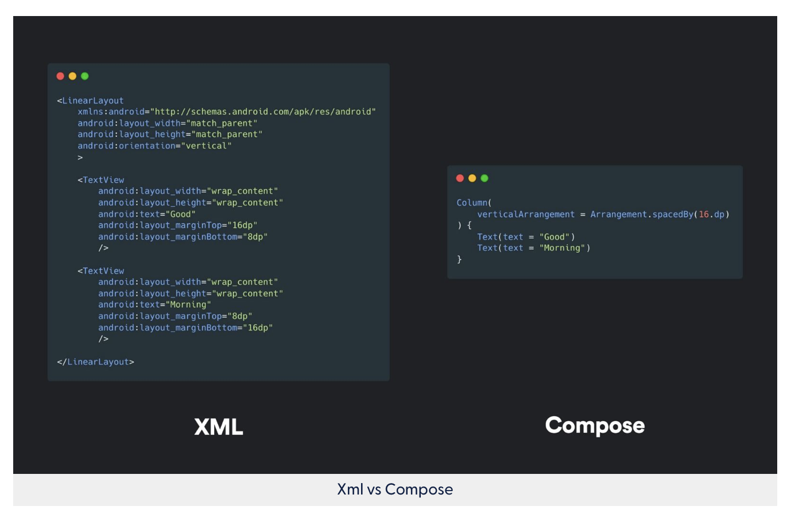

- `viewBinding`
	-
- ## Programming
	- `res/layout/main.xml` and choose "Split" on top right bar
	  collapsed:: true
		- 
		-
	- `LayoutInflater` from the provided context (`context` of the `parent`). The layout inflater knows how to inflate an XML layout into a hierarchy of view objects.
	- Padding main `View`
	  collapsed:: true
		- ```xml
		  <androidx.constraintlayout.widget.ConstraintLayout xmlns:android="http://schemas.android.com/apk/res/android"
		  	android:padding="16dp"
		      tools:context=".MainActivity">
		  ```
	- `TextView` = Text Field
		-
		- `android:hint`
		- `android:inputType`
	- `RadioGroup`
	  collapsed:: true
		- `RadioButton`
			- `text`
		- `orientation`
		- `checkedButton`
	- `Switch`
	  collapsed:: true
		- `isChecked`
	- `match_parent` and `wrap_content`
	  collapsed:: true
		- use for `layout_width` and `layout_height`
		- `wrap_content`: length to content,
		- you can't set `match_parent` on a child of `ConstraintLayout`
		  collapsed:: true
			- Setting the width to `0dp` tells the system not to calculate the width, just try to match the constraints that are on the view.
	- ### Constraints
		- `ConstraintLayout` vs `FrameLayout` vs `LinearLayout`
		- ```xml
		  <EditText 
		  		app:layout_constraintStart_toStartOf="parent"
		          app:layout_constraintTop_toTopOf="parent"/>
		  ```
	- ### Rename ID
	  collapsed:: true
		- ```xml
		  <EditText 
		  		android:id="@+id/cost_of_service"/>
		  ```
	-
- ## Layout Editor
	- `res/layout/main.xml`
	  collapsed:: true
		- ```xml
		  <androidx.constraintlayout.widget.ConstraintLayout  
		      ...
		      android:layout_width="match_parent"
		      android:layout_height="match_parent"
		      android:padding="16dp"
		      tools:context=".MainActivity">
		  ```
- ## Compose
  collapsed:: true
	- 
	-
	- [Jetpack Compose 101: The Basics - Appcircle Blog](https://blog.appcircle.io/article/jetpack-compose-101-the-basics)
	-
- ## Theme
	- [Color Tool - Material Design](https://m2.material.io/resources/color/#!/?view.left=0&view.right=0&primary.color=B71C1C&secondary.color=AB47BC)
	-
	-
- ## App icons
-