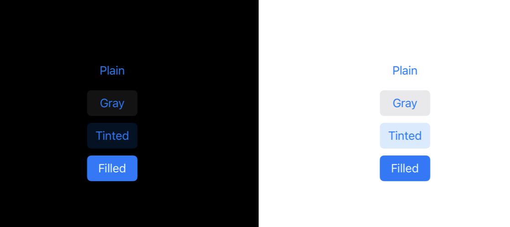

- ## Button.Configuration
	- ### Samples
	  collapsed:: true
		- `UIButton.Configuration.plain()`
		- `UIButton.Configuration.gray()`
		- `UIButton.Configuration.tinted()`
		- `UIButton.Configuration.filled()`
		- 
- ## Padding
	- Just constraint the height
- ## title
	- using `setTitle(title, state)`
-